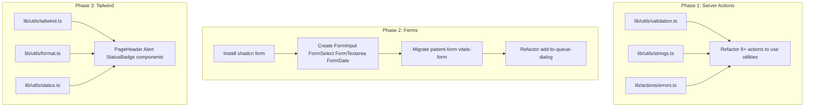

# CHO System Code Refactoring Plan

## Current State Summary

Based on review of [docs/project_status.md](docs/project_status.md), [Project_roadmap.md](Project_roadmap.md), and codebase exploration:

- **Actions**: 23 files with duplicated validation error formatting (8+ files), `emptyToNull` (3 files), and inconsistent error handling
- **Forms**: Patient form (792 lines), vitals form (384 lines), add-to-queue dialog (390 lines) with mixed patterns (React Hook Form vs native form)
- **Components**: `CustomFormField.tsx` exists but is entirely commented out; no shadcn `form` component; repeated Input/Select/Textarea patterns
- **Tailwind**: Repeated class strings (card, page header, flex layouts, alert styling) across 25+ files; custom `clinical-`* classes used only in patient-form
- **Lib/utils**: Only `cn()` and `generatePatientCode()`; no format, status, or string utilities

---

## Phase 0: Cleanup, File Removal, and Backend/Frontend Separation

### 0.1 Files to Remove


| File                                                                         | Reason                                                                                                                                                                         |
| ---------------------------------------------------------------------------- | ------------------------------------------------------------------------------------------------------------------------------------------------------------------------------ |
| [components/forms/CustomFormField.tsx](components/forms/CustomFormField.tsx) | Entirely commented out (172 lines); references missing deps (react-datepicker, react-phone-number-input, checkbox); outdated import paths; replaced by Phase 2 form components |


### 0.2 Duplicate Documentation (Consolidate)


| Root File                                | docs/ Equivalent                                   | Action                                                                                                                                                                            |
| ---------------------------------------- | -------------------------------------------------- | --------------------------------------------------------------------------------------------------------------------------------------------------------------------------------- |
| [project_status.md](project_status.md)   | [docs/project_status.md](docs/project_status.md)   | Different content: root = summary (194 lines), docs = detailed checklist (589 lines). **Keep docs/** as canonical. Remove root `project_status.md` or add README pointer to docs/ |
| [Project_roadmap.md](Project_roadmap.md) | [docs/Project_roadmap.md](docs/Project_roadmap.md) | Different content: root = phase overview (314 lines), docs = developer+AI guide (562 lines). **Keep both** or consolidate into docs/ with single source of truth                  |


**Recommendation**: Move root `project_status.md` and `Project_roadmap.md` into `docs/` with distinct names (e.g., `docs/project_status_summary.md` if keeping both), or delete root copies and use `docs/` exclusively. Update any references.

### 0.3 proxy.ts 

**Current**: [proxy.ts](proxy.ts) exports `proxy` function. auth is enforced at layout level via `requireSession()`.

### 0.4 Backend/Frontend Separation

**Principle**: In Next.js App Router, "backend" = server-only code (actions, db, auth guards, validators); "frontend" = client components, hooks, UI. Separation is by *usage* and *import boundaries*, not physical folders.

**Proposed lib/ structure** (logical separation without moving everything):

```
lib/
├── server/              # NEW — server-only (backend)
│   ├── db/              # move from lib/db
│   ├── auth/            # move from lib/auth
│   ├── validators/      # move from lib/validators
│   └── patient-code.ts  # move from lib/utils (db-dependent)
├── client/              # NEW — client-only (frontend)
│   ├── format.ts        # formatDate, formatTime, formatSex
│   ├── status.ts        # PRIORITY_VARIANTS, etc.
│   └── tailwind.ts      # class constants
├── shared/              # NEW — used by both
│   ├── constants/       # move from lib/constants
│   ├── utils/           # cn only (move from lib/utils/index)
│   └── types.ts         # shared types (extract from lib/auth/types if needed)
└── actions/             # NEW — action helpers (lib/actions from Phase 1)
    ├── errors.ts
    └── audit.ts
```

**Alternative (lower disruption)**: Keep current flat `lib/` structure. Add subfolders only for *new* code:

- `lib/server/` — for new server-only utils (validation, strings when used only in actions)
- `lib/client/` — for new client-only utils (format, status, tailwind)
- Existing `lib/db`, `lib/auth`, `lib/validators`, `lib/constants` stay in place

**Recommendation**: Use **Alternative** — minimal moves. Create `lib/server/` and `lib/client/` only for *new* utilities. Move existing folders only if user explicitly wants full restructure (high import churn).

### 0.5 Folder Move Summary (If Full Separation Chosen)


| From                   | To                      | Import Updates                               |
| ---------------------- | ----------------------- | -------------------------------------------- |
| lib/db                 | lib/server/db           | All actions, lib/auth (if it uses db)        |
| lib/auth               | lib/server/auth         | All pages, layouts, actions, hooks           |
| lib/validators         | lib/server/validators   | All actions                                  |
| lib/utils/patient-code | lib/server/patient-code | create-patient, create-patient-and-encounter |
| lib/constants          | lib/shared/constants    | Many files                                   |
| lib/utils/index (cn)   | lib/shared/utils        | 13+ components                               |


**tsconfig paths**: Add `@/lib/server/`*, `@/lib/client/`*, `@/lib/shared/*` or keep `@/*` with new paths.

---

## lib/utils Folder Review

### Current State


| File                                                   | Exports               | Consumers                                          | Notes                                    |
| ------------------------------------------------------ | --------------------- | -------------------------------------------------- | ---------------------------------------- |
| [lib/utils/index.ts](lib/utils/index.ts)               | `cn`                  | 13+ components (UI, layout, triage)                | clsx + tailwind-merge; no other exports  |
| [lib/utils/patient-code.ts](lib/utils/patient-code.ts) | `generatePatientCode` | create-patient.ts, create-patient-and-encounter.ts | Async, db-dependent; accepts optional tx |


### Import Path Inconsistency

- `@/lib/utils` — used by label, card, triage-queue-card
- `@/lib/utils/index` — used by most UI components (button, input, select, etc.)

**Recommendation**: Standardize on `@/lib/utils` (index is implicit). Update UI components to drop `/index` during refactor.

### Dependency Boundaries


| New utility   | Server-only?  | Client-safe? | Dependencies          |
| ------------- | ------------- | ------------ | --------------------- |
| validation.ts | Yes (actions) | No           | zod, @/lib/auth/types |
| strings.ts    | Yes (actions) | Yes          | none                  |
| format.ts     | No            | Yes          | none                  |
| status.ts     | No            | Yes          | none                  |
| tailwind.ts   | No            | Yes          | none                  |


### Barrel Export Strategy

**Keep index.ts minimal** — only `cn`. Do not add barrel re-exports for new utils.

**Rationale**:

- validation.ts: Server-only; actions import directly from `@/lib/utils/validation`
- strings.ts: Server-only; actions import from `@/lib/utils/strings`
- format.ts, status.ts, tailwind.ts: Client-only; components import from `@/lib/utils/format`, etc.
- Avoids pulling zod into client bundles when components import format-only
- Clear separation of concerns; explicit imports

### patient-code.ts Placement

**Keep in lib/utils** for now. It is a focused utility that happens to use db. Alternatives considered:

- `lib/db/patient-code.ts` — db is for connection/queries; patient-code is domain logic
- `lib/services/` — services folder does not exist; overkill for one function

If more db-dependent utilities accumulate (e.g., lab order code, prescription number), consider `lib/services/` later.

### Post-Refactor Layout

```
lib/utils/
├── index.ts          # cn only (unchanged)
├── patient-code.ts   # generatePatientCode (unchanged)
├── validation.ts     # NEW — formatZodErrors, createValidationError (server)
├── strings.ts        # NEW — emptyToNull (server)
├── format.ts         # NEW — formatDate, formatTime, formatSex, formatDateForInput (client)
├── status.ts         # NEW — PRIORITY_VARIANTS, PRIORITY_LABELS (client)
└── tailwind.ts       # NEW — class constants (client)
```

### Extraction Targets (from codebase)


| Utility                        | Source                                      | Current usage                             |
| ------------------------------ | ------------------------------------------- | ----------------------------------------- |
| formatDateForInput             | patient-form.tsx:115                        | birthDate, philhealthEligibilityStart/End |
| formatTime                     | triage-queue-card.tsx:17                    | Arrival time display                      |
| formatSex                      | triage-queue-card.tsx:24                    | Patient sex display                       |
| toLocaleDateString             | patient-detail-view.tsx, patients-table.tsx | Date display (en-PH)                      |
| priorityVariant, priorityLabel | triage-queue-card.tsx:39–48                 | Badge variant/label                       |


### lib/actions Folder (New)

`lib/actions/` does not exist. Create it for:

- `lib/actions/errors.ts` — createError, ActionErrorCodes
- `lib/actions/audit.ts` — createAuditLog (optional)

These are action-layer helpers, not general utils; they belong in lib/actions, not lib/utils.

---

## Phase 1: Server Action Utilities (High Impact)

### 1.1 Validation Utilities

Create [lib/utils/validation.ts](lib/utils/validation.ts):

```typescript
// formatZodErrors: ZodError -> Record<string, string[]>
// createValidationError: fieldErrors -> ActionResult<never>
```

**Impact**: Remove ~60 lines of duplicated code across 8+ action files.

### 1.2 Action Error Helpers

Create [lib/actions/errors.ts](lib/actions/errors.ts):

- `createError(code, message, fieldErrors?)` - standardized error response
- `ActionErrorCodes` constant object (VALIDATION_ERROR, NOT_FOUND, etc.)

### 1.3 String Utilities

Create [lib/utils/strings.ts](lib/utils/strings.ts):

```typescript
export function emptyToNull(val: string | undefined | null): string | null
```

**Impact**: Remove inline `emptyToNull` from `create-patient.ts`, `update-patient.ts`, `create-patient-and-encounter.ts`.

### 1.4 Audit Log Helper (Optional)

Create [lib/actions/audit.ts](lib/actions/audit.ts):

- `createAuditLog(tx, session, action, entity, entityId, metadata?)` - centralizes audit creation pattern

**Refactor targets**: All actions that call `tx.auditLog.create()` (6+ files).

---

## Phase 2: Reusable Form Components (shadcn-based)

### 2.1 Install shadcn Form Component

```bash
npx shadcn@latest add form
```

This provides `FormField`, `FormItem`, `FormLabel`, `FormControl`, `FormMessage` - the foundation for consistent form handling.

### 2.2 Form Field Components

Create in [components/forms/](components/forms/):


| Component      | Purpose                                                  | Replaces                                      |
| -------------- | -------------------------------------------------------- | --------------------------------------------- |
| `FormInput`    | Input + Label + Error (with optional required indicator) | Repeated pattern in patient-form, vitals-form |
| `FormSelect`   | Select + Label + Error                                   | Repeated in patient-form, add-to-queue-dialog |
| `FormTextarea` | Textarea + Label + Error                                 | patient-form, vitals-form                     |
| `FormDate`     | Date input + Label + Error                               | patient-form, add-to-queue-dialog             |
| `FormSection`  | Section header with optional icon                        | patient-form SectionHeader                    |


Each component:

- Uses shadcn `FormField` + `FormItem` + `FormLabel` + `FormControl` + `FormMessage`
- Accepts `control` from React Hook Form
- Supports `required`, `placeholder`, `disabled`
- Consistent error display styling

### 2.3 CustomFormField Decision

**Option A (Recommended)**: Remove [components/forms/CustomFormField.tsx](components/forms/CustomFormField.tsx) - it is commented out, references missing dependencies (react-datepicker, react-phone-number-input, checkbox), and uses outdated import paths. The new `FormInput`, `FormSelect`, etc. provide a simpler, maintainable alternative.

**Option B**: Revive CustomFormField - would require adding dependencies and shadcn form; higher effort for similar outcome.

### 2.4 Migrate Forms

- **patient-form.tsx**: Replace inline field patterns with `FormInput`, `FormSelect`, `FormTextarea`, `FormDate`, `FormSection`. Target: reduce from ~792 to ~500 lines.
- **vitals-form.tsx**: Use new form components. Target: reduce from ~384 to ~250 lines.
- **add-to-queue-dialog.tsx**: Refactor "New Patient" tab to use React Hook Form + new components instead of `useState`-based form. Improves consistency and server-side field error handling.

---

## Phase 3: Tailwind and Layout Utilities

### 3.1 Tailwind Class Constants

Create [lib/utils/tailwind.ts](lib/utils/tailwind.ts):

```typescript
// Layout
export const flexBetween = "flex items-center justify-between"
export const flexCenter = "flex items-center gap-2"
export const flexStart = "flex items-start gap-3"

// Cards
export const cardBase = "rounded-lg border bg-card"
export const cardInteractive = "rounded-lg border bg-card p-4 transition-all hover:bg-accent/50"

// Alerts
export const alertError = "rounded-md bg-destructive/10 p-3 text-sm text-destructive"
export const alertSuccess = "rounded-md bg-primary/10 p-3 text-sm text-primary"

// Form inputs (if not using component variants)
export const inputClinical = "bg-input/50 border-border/60 focus-visible:border-primary/60"
```

Use `cn()` for conditional composition where needed.

### 3.2 Format Utilities

Create [lib/utils/format.ts](lib/utils/format.ts):

- `formatDate(date, locale?)` - date display; default `en-PH` (used in patient-detail-view, patients-table)
- `formatTime(isoString)` - time display; extract from triage-queue-card
- `formatSex(sex)` - MALE/FEMALE/OTHER display; extract from triage-queue-card
- `formatDateForInput(date)` - YYYY-MM-DD for HTML date inputs; extract from patient-form

### 3.3 Status Utilities

Create [lib/utils/status.ts](lib/utils/status.ts):

- `PRIORITY_VARIANTS` - Badge variants for HIGH/MEDIUM/LOW
- `PRIORITY_LABELS` - Display labels
- `ENCOUNTER_STATUS_VARIANTS` - For encounter status badges (when doctor module is built)

### 3.4 Reusable Layout Components


| Component     | Location                                     | Purpose                                                                                                 |
| ------------- | -------------------------------------------- | ------------------------------------------------------------------------------------------------------- |
| `PageHeader`  | `components/layout/page-header.tsx`          | Title + optional description + actions slot. Replaces 13+ instances of `text-2xl font-semibold` headers |
| `Alert`       | `components/ui/alert.tsx` (or extend shadcn) | Error/success/warning/info variants. Replaces inline `rounded-md bg-destructive/10...`                  |
| `StatusBadge` | `components/ui/status-badge.tsx`             | Wrapper that maps status enum to Badge variant                                                          |


---

## Phase 4: Functionality Improvements (Roadmap-Aligned)

Based on [Project_roadmap.md](Project_roadmap.md) and [docs/project_status.md](docs/project_status.md):

### 4.1 Doctor Module (Current Sprint)

- **Diagnosis picker**: Use new `FormSelect` with search (combobox pattern) - shadcn has `Command` component for searchable selects
- **Lab order form / Prescription form**: Build from the start with new form components to avoid future refactoring

### 4.2 Consistency Improvements

- **Form submission pattern**: Create a shared `useFormAction` hook or pattern that handles: loading state, error display, field error injection via `setError`, success callback
- **Action response handling**: Standardize how pages handle `result.ok` vs `result.error` (e.g., toast + redirect vs inline error)

### 4.3 Performance (Phase 6)

- Pagination is already in place for patients; ensure new lists (triage queue, appointments, lab queue) use similar patterns
- Consider `React.cache()` for read-only actions that are called multiple times per request (e.g., getBarangays, getCategories)

---

## Implementation Order




**Recommended sequence**: Phase 0 (cleanup, proxy→middleware, doc consolidation) first; then Phase 1 (server actions), Phase 2 (forms), Phase 3 (Tailwind/layout). Phase 4 items can be done incrementally.

---

## Files to Create


| File                                 | Purpose                                               |
| ------------------------------------ | ----------------------------------------------------- |
| `lib/utils/validation.ts`            | formatZodErrors, createValidationError                |
| `lib/utils/strings.ts`               | emptyToNull                                           |
| `lib/actions/errors.ts`              | createError, ActionErrorCodes                         |
| `lib/actions/audit.ts`               | createAuditLog helper (optional)                      |
| `lib/utils/tailwind.ts`              | Class constants                                       |
| `lib/utils/format.ts`                | formatDate, formatTime, formatSex, formatDateForInput |
| `lib/utils/status.ts`                | PRIORITY_VARIANTS, PRIORITY_LABELS                    |
| `components/forms/form-input.tsx`    | Reusable FormInput                                    |
| `components/forms/form-select.tsx`   | Reusable FormSelect                                   |
| `components/forms/form-textarea.tsx` | Reusable FormTextarea                                 |
| `components/forms/form-date.tsx`     | Reusable FormDate                                     |
| `components/forms/form-section.tsx`  | Section header                                        |
| `components/layout/page-header.tsx`  | Page title component                                  |
| `components/ui/alert.tsx`            | Alert variants (or add via shadcn)                    |
| `components/ui/status-badge.tsx`     | Status-to-Badge mapper                                |


## Files to Modify

- All actions with validation: use `formatZodErrors` + `createValidationError`
- `create-patient.ts`, `update-patient.ts`, `create-patient-and-encounter.ts`: use `emptyToNull` from lib
- `patient-form.tsx`, `vitals-form.tsx`, `add-to-queue-dialog.tsx`: use new form components
- Pages with repeated headers: use `PageHeader`
- Components with inline alert styling: use `Alert`
- `patient-detail-view.tsx`, `patients-table.tsx`: use `formatDate` from format utils
- `triage-queue-card.tsx`: use `PRIORITY_VARIANTS`, `PRIORITY_LABELS` from status utils; use `formatTime`, `formatSex` from format utils (remove inline definitions)

## Files to Remove

- `components/forms/CustomFormField.tsx` (dead code; remove immediately or after Phase 2 form components)
- `project_status.md` (root) — if consolidating docs; keep `docs/project_status.md` as canonical

---

## Risk Mitigation

- **Incremental refactoring**: Do one action file at a time; verify behavior after each change
- **Form migration**: Migrate one form (e.g., vitals-form) first as proof of concept before patient-form
- **Tailwind constants**: Start with 3-5 most repeated patterns; expand gradually
- **Tests**: Add unit tests for validation utils and format utils before wide refactor

