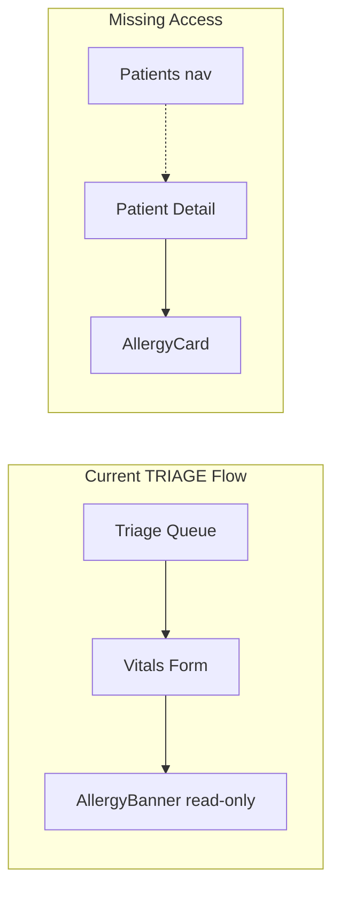

# TRIAGE Role - Allergy Management UI Access

## Problem

TRIAGE has backend permission for allergy actions but **no UI to access them**:

1. **Sidebar**: "Patients" is only visible to `["ADMIN", "REGISTRATION"]` in `[components/layout/app-sidebar.tsx](components/layout/app-sidebar.tsx)`. TRIAGE cannot navigate to patient detail where `AllergyCard` lives.
2. **Triage flow**: `[components/triage/vitals-form.tsx](components/triage/vitals-form.tsx)` shows `AllergyBanner` (read-only) but no `AllergyCard` (add/edit/remove). TRIAGE works from the triage queue and never sees the allergy management UI.




---

## Solution

### 1. Add TRIAGE to Patients sidebar

**File**: `[components/layout/app-sidebar.tsx](components/layout/app-sidebar.tsx)`

Change Patients nav item from:

```ts
roles: ["ADMIN", "REGISTRATION"],
```

to:

```ts
roles: ["ADMIN", "REGISTRATION", "TRIAGE"],
```

This lets TRIAGE navigate to Patients → search → patient detail → manage allergies.

---

### 2. Embed AllergyCard in triage vitals form

**Files**: `[app/(dashboards)/triage/page.tsx](app/(dashboards)`/triage/page.tsx), `[components/triage/triage-page-client.tsx](components/triage/triage-page-client.tsx)`, `[components/triage/vitals-form.tsx](components/triage/vitals-form.tsx)`

**Flow**:

- Triage page gets session via `requireRole`, computes `canEditAllergies = ["REGISTRATION","TRIAGE","DOCTOR","ADMIN"].includes(session.role)`, passes to `TriagePageClient`.
- `TriagePageClient` passes `canEditAllergies` and `selectedEncounter` to `VitalsForm`.
- `VitalsForm` when `selectedEncounter` is set:
  - Fetches full patient via `getPatientAction(selectedEncounter.patientId)` (client-side, e.g. in `useEffect` or a small wrapper).
  - Renders `AllergyCard` below the existing `AllergyBanner`, with `canEdit={canEditAllergies}`, `patientId`, `allergyStatus`, `allergies`, `allergyConfirmedAt`, `allergyConfirmedBy`, and `onUpdate` to refresh queue/vitals state.

**VitalsForm changes**:

- Add props: `canEditAllergies: boolean`
- When `selectedEncounter` is set, fetch patient (or use a `TriageAllergySection` component that fetches and renders `AllergyCard`).
- Show `AllergyCard` in a collapsible section or below the banner, with `onUpdate` calling a callback to refresh (e.g. `setRefreshKey` in parent).

**Data**: `getPatientAction` already allows TRIAGE (`requireRoleForAction(["REGISTRATION", "TRIAGE", "DOCTOR"])`), so no backend changes needed.

---

### 3. Optional: "View patient" link in triage card

Add a link on the triage queue card (or vitals header) to `/patients/[patientId]` so TRIAGE can open patient detail in a new tab without leaving the triage flow. This complements the embedded `AllergyCard` and gives access to full patient record.

---

## Summary


| Change                          | Purpose                                         |
| ------------------------------- | ----------------------------------------------- |
| Sidebar: add TRIAGE to Patients | Navigate to patient detail and manage allergies |
| VitalsForm: embed AllergyCard   | Manage allergies without leaving triage flow    |
| Optional: View patient link     | Quick access to full patient record             |


Backend already allows TRIAGE for all allergy actions; only UI access is being added.