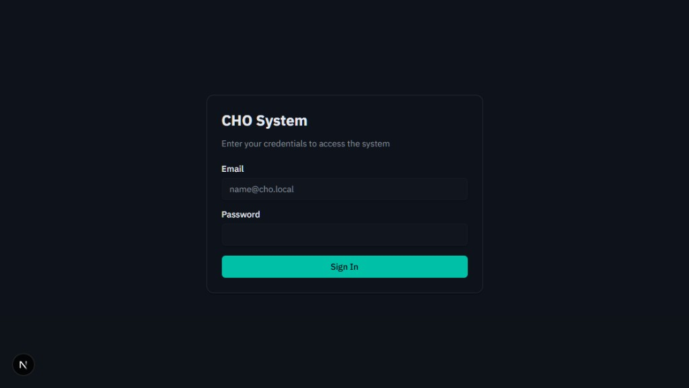
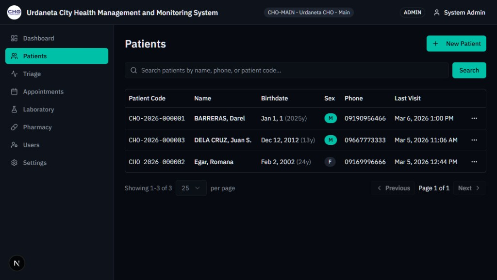
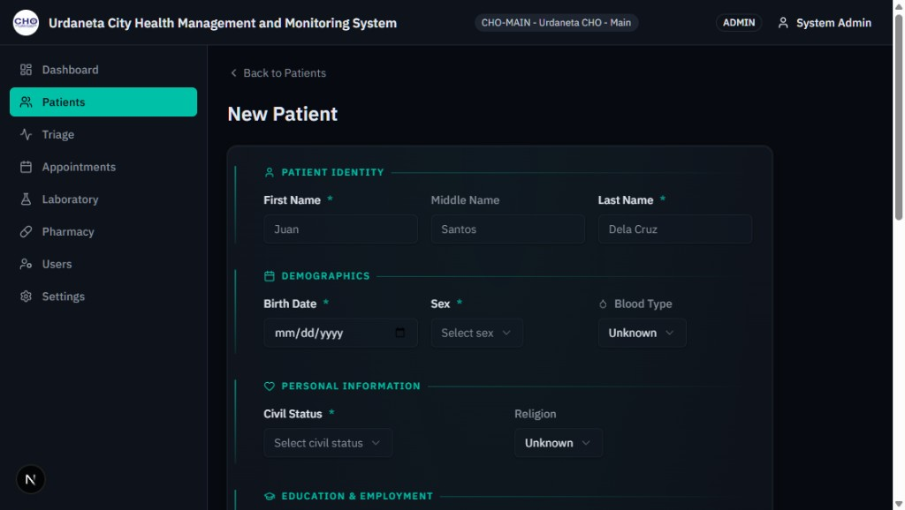
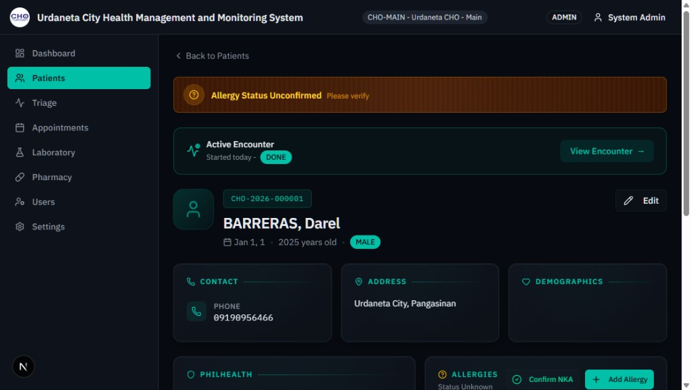
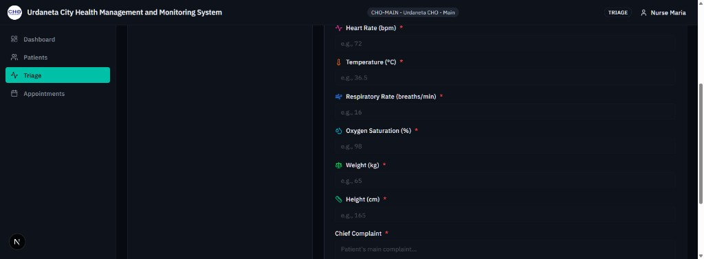
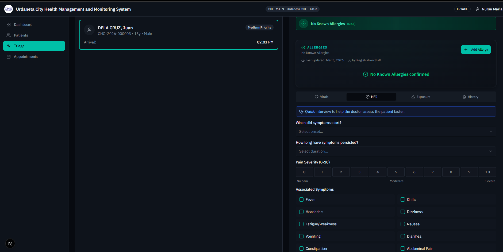
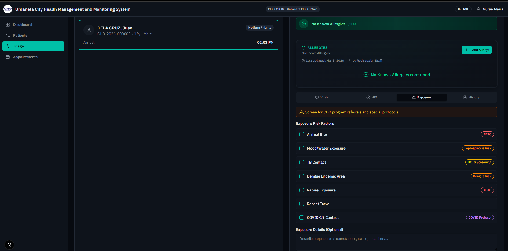
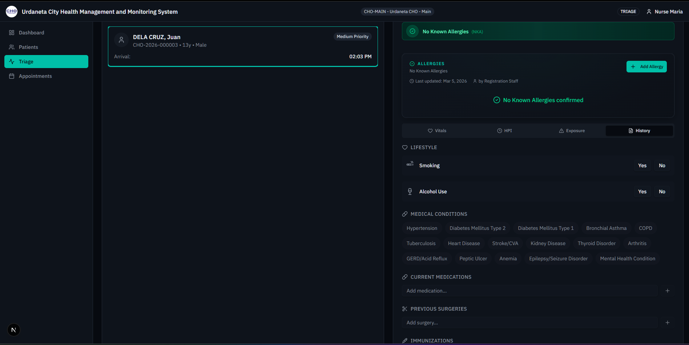
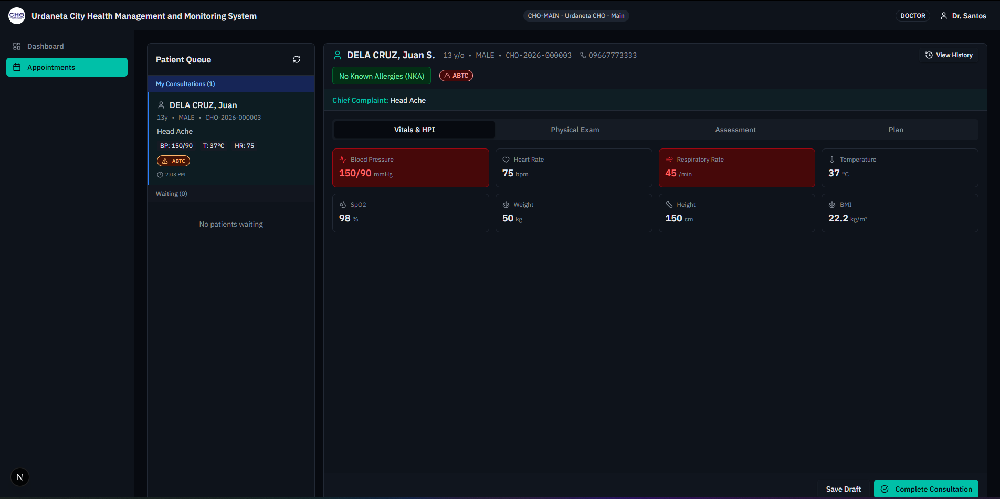

# CHO System
## Executive & Department Head Presentation

**City Health Office Medical Records and Clinic Management System**  
For Philippine City Health Offices (Main Facility + Barangay Health Centers)

---

## 1. Step-by-Step Process: Registration to Doctor Appointments

End-to-end patient flow from initial registration through doctor consultation:

```mermaid
flowchart LR
    Login[Login] --> Reg[Registration]
    Reg --> Patients[Patients Search/Create]
    Patients --> FwdTriage[Forward to Triage]
    FwdTriage --> TriageQueue[Triage Queue]
    TriageQueue --> Claim1[FIFO Claim]
    Claim1 --> Vitals[Vitals + Chief Complaint]
    Vitals --> Submit[Submit Triage]
    Submit --> DrQueue[Doctor Appointments Queue]
    DrQueue --> Claim2[FIFO Claim]
    Claim2 --> Consult[Consultation]
    Consult --> Done[Done / Lab / Pharmacy]
```

### Step 1: Login

Staff log in with role-based credentials. The system redirects each role to their assigned module (e.g., Registration → Patients, Triage → Triage Queue, Doctor → Appointments).

<!-- TODO: Add screenshot -->

---

### Step 2: Patients List

Registration staff search for existing patients by name, date of birth, phone, or patient ID. Paginated table shows patient records with quick actions.

<!-- TODO: Add screenshot -->

---

### Step 3: Add or Edit Patient

New patients are created via a structured form. Returning patients can be edited. Sections include:

- Personal info (identity, demographics)
- Contact info (address, education, barangay)
- PhilHealth (membership type, eligibility period, principal/dependent)

<!-- TODO: Add screenshot -->

---

### Step 4: Patient Detail & Forward to Triage

Patient detail view shows demographics, PhilHealth card, and allergy status. A prominent **Forward to Triage** button creates an encounter with status `WAIT_TRIAGE` and adds the patient to the triage queue.

<!-- TODO: Add screenshot -->

---

### Step 5: Triage Queue

Triage nurses see today's patients waiting for triage in **FIFO order**. One nurse claims one patient at a time to ensure fair processing. **Add to Queue** allows quick registration of walk-in patients.

<!-- TODO: Add screenshot -->

---

### Step 6: Vitals Form

After claiming a patient, the nurse enters vitals (BP, HR, RR, Temp, SpO2, Weight, Height), chief complaint, and manages allergies (add/edit/remove, confirm NKA). Submit triage advances the encounter to `TRIAGED` / `WAIT_DOCTOR`.

<!-- TODO: Add screenshot -->

---

### Step 7: Doctor Appointments Queue

Doctors see their assigned appointments in **Today** / **Upcoming** / **Completed** tabs. FIFO claiming ensures one patient per doctor. Claim/Release controls prevent queue jumping.

<!-- TODO: Add screenshot -->

---

### Step 8: Consultation

The consultation view displays:

- Patient snapshot (demographics, allergies)
- Triage summary (vitals, chief complaint)
- Physical exam, assessment, and plan sections
- Actions to complete encounter (DONE, FOR_LAB, FOR_PHARMACY)

<!-- TODO: Add screenshot -->

---

### Screenshot Instructions

To capture screenshots for this presentation, run the development server and log in with test users. See [screenshots/SCREENSHOTS_README.md](screenshots/SCREENSHOTS_README.md) for step-by-step instructions and credentials.

---

## 2. Benefits of the System

### For Patients

| Benefit | Description |
|---------|-------------|
| **Faster service** | FIFO queues ensure fair, predictable ordering |
| **Allergy safety** | Allergy banner on all views, NKA confirmation, severity tracking |
| **PhilHealth-ready** | Membership type, eligibility period, principal/dependent captured at registration |
| **Records continuity** | Encounter history preserved; soft deletes prevent data loss |
| **Multi-facility access** | Register at any facility; same-day encounter rules prevent duplicate visits across facilities |

### For Management

| Benefit | Description |
|---------|-------------|
| **Audit trail** | All actions logged (userId, action, entity, timestamp) for compliance |
| **Multi-facility** | Main + Barangay health centers with role and scope enforcement |
| **Role-based access** | 6 roles with 3-layer security: route guard, action validation, audit logging |
| **Queue visibility** | Real-time triage and doctor queues per facility |
| **ICD-10 taxonomy** | 10 categories, 86 subcategories, 148 codes ready for diagnosis and reporting |

---

## 3. Reports That Can Be Generated

The data model supports the following reports. Implementation status: **planned** (Phase 5); data structures are in place.

| Report | Purpose | Data Source |
|--------|---------|-------------|
| **Daily encounter summary** | Daily volume by facility | Encounter, TriageRecord |
| **Morbidity report** | By diagnosis/subcategory | Diagnosis, DiagnosisSubcategory |
| **Notifiable disease report** | DOH compliance | Diagnosis (isNotifiable flag) |
| **Animal bite report** | ABTC tracking | Diagnosis (isAnimalBite flag) |
| **Inventory consumption** | Stock usage per facility | InventoryTxn |
| **Export formats** | Excel, PDF | TBD |

---

## 4. Expansions of Other Modules

| Module | Status | Capabilities |
|--------|--------|--------------|
| **Laboratory** | Planned | Pending/In Progress/Released queue; result upload; release workflow |
| **Pharmacy** | Planned | Dispense queue; inventory with FEFO; low-stock/expiry alerts |
| **Admin** | Partial | User CRUD, facility management, Dashboard KPIs |
| **Future (Post-MVP)** | Planned | Patient portal, SMS notifications, PhilHealth e-claims, DOH integration |

---

## 5. Thoughts and Recommendations

1. **Prioritize completion of Doctor Consultation** — Finishing diagnosis entry, lab orders, and prescriptions unblocks the Lab and Pharmacy workflows end-to-end.

2. **Screenshot capture for demos** — Schedule a short walkthrough to populate `screenshots/` for executive presentations and training materials.

3. **Report rollout sequence** — Start with the Daily encounter summary for immediate operational visibility; add morbidity and notifiable disease reports as diagnosis entry is used.

4. **Multi-facility adoption** — Roll out by facility tier: Main facility first, then barangays, with role-based training per role (Registration, Triage, Doctor).
