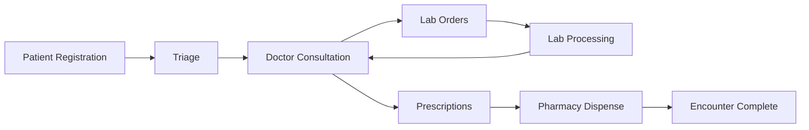

# CHO System - Project Roadmap

**Last Updated:** February 23, 2026

---

## Vision

A complete, digitized workflow system for Philippine City Health Offices:

```
REGISTRATION → TRIAGE → DOCTOR → LAB (optional) → PHARMACY (optional) → DONE
```

---

## Phase Overview

| Phase | Focus | Status |
|-------|-------|--------|
| Phase 1 | Foundation & Patient Flow | Done |
| Phase 2 | Doctor Consultation | In Progress |
| Phase 3 | Laboratory Module | Not Started |
| Phase 4 | Pharmacy Module | Not Started |
| Phase 5 | Admin & Reporting | Not Started |
| Phase 6 | Polish & Deployment | Not Started |

---

## Phase 1: Foundation & Patient Flow (DONE)

### Completed

- [x] Project setup (Next.js 16, Prisma 7, PostgreSQL)
- [x] Database schema design (20+ models)
- [x] Multi-facility architecture (MAIN + BARANGAY)
- [x] Authentication system (JWT, bcrypt, httpOnly cookies)
- [x] Role-based access control (6 roles)
- [x] Scope enforcement (FACILITY_ONLY, CITY_WIDE)
- [x] App shell layout (sidebar, navbar, responsive)
- [x] Patient registration module
  - [x] Search patients
  - [x] Create/edit patient
  - [x] View patient details
  - [x] Forward to triage
- [x] Triage module
  - [x] Triage queue (today's WAIT_TRIAGE)
  - [x] Vitals form (BP, HR, RR, Temp, SpO2, Weight, Height)
  - [x] Submit triage → status TRIAGED
  - [x] Quick patient registration
- [x] Barangay reference data (34 Urdaneta barangays)
- [x] Diagnosis taxonomy (10 categories, 86 subcategories, 148 ICD-10 codes)

---

## Phase 2: Doctor Consultation (IN PROGRESS)

### Priority: Complete Doctor Workflow

#### 2.1 Appointments Queue
- [ ] Show TRIAGED encounters assigned to logged-in doctor
- [ ] Filter by date (Today / Upcoming / Completed)
- [ ] Encounter status badges
- [ ] Click to open consultation

#### 2.2 Consultation View
- [ ] Patient summary panel (demographics, history)
- [ ] Triage vitals display (read-only)
- [ ] Chief complaint from triage

#### 2.3 Diagnosis Entry
- [x] Diagnosis taxonomy backend (categories, subcategories, ICD-10)
- [ ] Diagnosis picker component (searchable dropdown)
- [ ] Support multiple diagnoses per encounter
- [ ] Free-text diagnosis option
- [ ] Notifiable disease alerts

#### 2.4 Lab Orders
- [ ] Create lab order form
- [ ] Select tests from catalog
- [ ] Set performing facility (MAIN only)
- [ ] View pending/completed lab results

#### 2.5 Prescriptions
- [ ] Create prescription form
- [ ] Medicine autocomplete from catalog
- [ ] Dosage, frequency, duration, quantity
- [ ] Instructions field
- [ ] Save prescription → encounter status FOR_PHARMACY

#### 2.6 Encounter Completion
- [ ] Mark encounter as DONE
- [ ] Generate encounter summary (printable)

---

## Phase 3: Laboratory Module

### Priority: Lab Order Processing

#### 3.1 Lab Queue
- [ ] View all pending lab orders (MAIN facility)
- [ ] Filter by status (PENDING / IN_PROGRESS / RELEASED)
- [ ] Show requesting facility badge

#### 3.2 Lab Processing
- [ ] Accept order (status → IN_PROGRESS)
- [ ] Enter structured results (JSON schema per test type)
- [ ] Upload result files (PDF, images)
- [ ] Preview uploaded files

#### 3.3 Result Release
- [ ] Review before release
- [ ] Release action (status → RELEASED)
- [ ] Notify requesting facility

#### 3.4 Lab Catalog
- [ ] Test type definitions
- [ ] Normal ranges
- [ ] Result templates

---

## Phase 4: Pharmacy Module

### Priority: Dispensing & Inventory

#### 4.1 Dispense Queue
- [ ] View encounters with FOR_PHARMACY status
- [ ] Show prescription details
- [ ] Check stock availability

#### 4.2 Dispensing
- [ ] Select items to dispense
- [ ] Choose stock lot (FEFO - First Expiry First Out)
- [ ] Confirm dispense → deduct inventory
- [ ] Print dispense receipt

#### 4.3 Inventory Management
- [ ] View stock levels per medicine per facility
- [ ] Low stock alerts (configurable threshold)
- [ ] Expiry alerts (30/60/90 day warnings)

#### 4.4 Stock Transactions
- [ ] Stock IN (receiving supplies)
- [ ] Stock ADJUST (corrections, damages)
- [ ] Transaction history with audit

#### 4.5 Medicine Catalog
- [ ] Add/edit medicines
- [ ] Generic name, brand, form, strength
- [ ] Unit of measure

---

## Phase 5: Admin & Reporting

### Priority: System Management

#### 5.1 User Management
- [ ] List all users with filters
- [ ] Create user (role, facility, scope)
- [ ] Edit user details
- [ ] Reset password
- [ ] Deactivate user (soft delete)

#### 5.2 Facility Management
- [ ] List facilities
- [ ] Add/edit facility
- [ ] Activate/deactivate

#### 5.3 Dashboard KPIs
- [ ] Today's statistics cards
  - Waiting Triage
  - Waiting Doctor
  - Pending Lab
  - For Pharmacy
- [ ] Recent activity feed
- [ ] Low stock alerts
- [ ] Lab backlog warnings

#### 5.4 Reports
- [ ] Daily encounter summary
- [ ] Morbidity report (by diagnosis)
- [ ] Notifiable disease report (DOH)
- [ ] Animal bite report (ABTC)
- [ ] Inventory consumption report
- [ ] Export to Excel/PDF

#### 5.5 Audit Logs
- [ ] View audit log with filters
- [ ] Search by user, action, entity
- [ ] Date range filtering

---

## Phase 6: Polish & Deployment

### Priority: Production Readiness

#### 6.1 Performance
- [ ] Query optimization (indexes verified)
- [ ] Pagination on all lists
- [ ] Loading states and skeletons

#### 6.2 Error Handling
- [ ] Consistent error boundaries
- [ ] User-friendly error messages
- [ ] Retry mechanisms

#### 6.3 Security Hardening
- [ ] Rate limiting
- [ ] Input sanitization review
- [ ] CORS configuration
- [ ] Security headers

#### 6.4 Testing
- [ ] Unit tests for validators
- [ ] Integration tests for actions
- [ ] E2E tests for critical flows

#### 6.5 Deployment
- [ ] Production build optimization
- [ ] PM2 process management
- [ ] PostgreSQL backup scripts
- [ ] File backup (lab results)
- [ ] Monitoring setup

#### 6.6 Documentation
- [ ] User manual per role
- [ ] Admin guide
- [ ] API documentation

---

## Future Enhancements (Post-MVP)

### Phase 7: Advanced Features
- [ ] Patient portal (view own records)
- [ ] SMS notifications
- [ ] Appointment scheduling
- [ ] Referral system between facilities
- [ ] Digital signatures for prescriptions

### Phase 8: Analytics
- [ ] Disease surveillance dashboard
- [ ] Trend analysis
- [ ] Geographic mapping (by barangay)
- [ ] Predictive stock ordering

### Phase 9: Integrations
- [ ] PhilHealth e-claims integration
- [ ] DOH reporting integration
- [ ] FHIR compliance (optional)

---

## Current Sprint Focus

**Sprint Goal:** Complete Doctor Consultation Module

### This Sprint
1. Appointments queue with filtering
2. Consultation view with patient summary
3. Diagnosis picker component (using taxonomy)
4. Lab order creation form
5. Prescription creation form

### Next Sprint
1. Lab module - queue and processing
2. Lab result upload and release
3. Pharmacy dispense workflow

---

## Technical Priorities

| Priority | Item | Reason |
|----------|------|--------|
| High | Doctor consultation UI | Unblocks full workflow |
| High | Diagnosis picker component | Taxonomy is ready |
| Medium | Lab order form | Enables lab workflow |
| Medium | Prescription form | Enables pharmacy workflow |
| Low | Dashboard KPIs | Admin convenience |
| Low | Reports | Can use direct DB queries initially |

---

## Dependencies



---

## Success Metrics (MVP)

- [ ] Complete patient flow from registration to done
- [ ] Multi-facility operation verified
- [ ] Lab orders flow to MAIN and back
- [ ] Inventory deduction accurate
- [ ] Audit trail complete for all actions
- [ ] No data loss on soft deletes
- [ ] Role permissions enforced correctly
