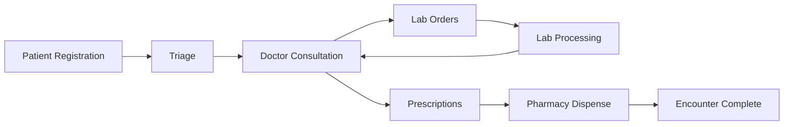

# CHO System - Project Roadmap

**Last Updated:** March 25, 2026

---

## Vision

A complete, digitized workflow system for Philippine City Health Offices:

```
REGISTRATION → TRIAGE → DOCTOR → LAB (optional) → PHARMACY (optional) → DONE
```

---

## Phase Overview

| Phase | Focus | Status |
|-------|-------|--------|
| Phase 1 | Foundation & Patient Flow | Done |
| Phase 2 | Doctor Consultation | Done |
| Phase 3 | Laboratory Module | Not Started |
| Phase 4 | Pharmacy Module | Not Started |
| Phase 5 | Admin & Reporting | Partial |
| Phase 6 | Polish & Deployment | Partial |

---

## Phase 1: Foundation & Patient Flow (DONE)

### Completed

- [x] Project setup (Next.js 16, Prisma 7, PostgreSQL)
- [x] Database schema design (31 models, 16 migrations)
- [x] Multi-facility architecture (MAIN + BARANGAY)
- [x] Authentication system (JWT, bcrypt, httpOnly cookies)
- [x] Role-based access control (6 roles)
- [x] Scope enforcement (FACILITY_ONLY, CITY_WIDE)
- [x] App shell layout (sidebar, navbar, responsive)
- [x] Patient registration module
  - [x] Search patients
  - [x] Create/edit patient
  - [x] View patient details
  - [x] Forward to triage
- [x] Triage module
  - [x] Triage queue (today's WAIT_TRIAGE)
  - [x] FIFO claiming system (one patient per nurse)
  - [x] Vitals form (BP, HR, RR, Temp, SpO2, Weight, Height)
  - [x] Submit triage → status TRIAGED
  - [x] Quick patient registration
  - [x] Allergy management (add/edit/remove, NKA confirmation)
- [x] Allergy module
  - [x] Patient allergy tracking with severity levels
  - [x] Allergy banner on patient views
  - [x] NKA (No Known Allergies) confirmation workflow
- [x] Barangay reference data (34 Urdaneta barangays)
- [x] Diagnosis taxonomy (10 categories, 86 subcategories, 148 ICD-10 codes)

---

## Phase 2: Doctor Consultation (DONE)

### Completed March 2026

#### 2.1 Appointments Queue
- [x] Show TRIAGED encounters assigned to logged-in doctor
- [x] Filter by date (Today / Upcoming / Completed)
- [x] Encounter status badges
- [x] FIFO claiming system with claim/rollback
- [x] Click to open consultation view

#### 2.2 Consultation View
- [x] Patient summary panel (demographics, allergies, history)
- [x] Triage vitals display (read-only)
- [x] Chief complaint from triage
- [x] 6-tab consultation form (Snapshot, Triage, History, Exam, Assessment, Plan)
- [x] Auto-save with dirty state tracking

#### 2.3 Diagnosis Entry
- [x] Diagnosis taxonomy backend (categories, subcategories, ICD-10)
- [x] Diagnosis picker component (searchable dropdown)
- [x] Support multiple diagnoses per encounter
- [x] Free-text diagnosis option
- [x] Notifiable disease alerts
- [x] ICD-10 code integration

#### 2.4 Lab Orders
- [x] Create lab order form
- [x] Select tests from catalog
- [x] Set performing facility (MAIN only)
- [x] View pending/completed lab results

#### 2.5 Prescriptions
- [x] Create prescription form
- [x] Medicine autocomplete from catalog
- [x] Dosage, frequency, duration, quantity
- [x] Instructions field
- [x] Save prescription → encounter status FOR_PHARMACY

#### 2.6 Encounter Completion
- [x] Mark encounter as DONE
- [x] Encounter status workflow complete

#### 2.7 Server Actions (17 total)
- [x] Consultation CRUD actions
- [x] Diagnosis actions
- [x] Lab order actions
- [x] Prescription actions
- [x] Patient history actions

---

## Phase 3: Laboratory Module

### Priority: Lab Order Processing

#### 3.1 Lab Queue
- [ ] View all pending lab orders (MAIN facility)
- [ ] Filter by status (PENDING / IN_PROGRESS / RELEASED)
- [ ] Show requesting facility badge

#### 3.2 Lab Processing
- [ ] Accept order (status → IN_PROGRESS)
- [ ] Enter structured results (JSON schema per test type)
- [ ] Upload result files (PDF, images)
- [ ] Preview uploaded files

#### 3.3 Result Release
- [ ] Review before release
- [ ] Release action (status → RELEASED)
- [ ] Notify requesting facility

#### 3.4 Lab Catalog
- [ ] Test type definitions
- [ ] Normal ranges
- [ ] Result templates

---

## Phase 4: Pharmacy Module

### Priority: Dispensing & Inventory

#### 4.1 Dispense Queue
- [ ] View encounters with FOR_PHARMACY status
- [ ] Show prescription details
- [ ] Check stock availability

#### 4.2 Dispensing
- [ ] Select items to dispense
- [ ] Choose stock lot (FEFO - First Expiry First Out)
- [ ] Confirm dispense → deduct inventory
- [ ] Print dispense receipt

#### 4.3 Inventory Management
- [ ] View stock levels per medicine per facility
- [ ] Low stock alerts (configurable threshold)
- [ ] Expiry alerts (30/60/90 day warnings)

#### 4.4 Stock Transactions
- [ ] Stock IN (receiving supplies)
- [ ] Stock ADJUST (corrections, damages)
- [ ] Transaction history with audit

#### 4.5 Medicine Catalog
- [ ] Add/edit medicines
- [ ] Generic name, brand, form, strength
- [ ] Unit of measure

---

## Phase 5: Admin & Reporting

### Priority: System Management

#### 5.1 User Management (DONE)
- [x] List all users with filters
- [x] Create user (role, facility, scope)
- [x] Edit user details
- [x] Reset password
- [x] Deactivate user (soft delete)
- [x] 7 server actions implemented

#### 5.2 Facility Management
- [ ] List facilities
- [ ] Add/edit facility
- [ ] Activate/deactivate

#### 5.3 Dashboard KPIs
- [ ] Today's statistics cards
  - Waiting Triage
  - Waiting Doctor
  - Pending Lab
  - For Pharmacy
- [ ] Recent activity feed
- [ ] Low stock alerts
- [ ] Lab backlog warnings

#### 5.4 Reports
- [ ] Daily encounter summary
- [ ] Morbidity report (by diagnosis)
- [ ] Notifiable disease report (DOH)
- [ ] Animal bite report (ABTC)
- [ ] Inventory consumption report
- [ ] Export to Excel/PDF

#### 5.5 Audit Logs
- [ ] View audit log with filters
- [ ] Search by user, action, entity
- [ ] Date range filtering

---

## Phase 6: Polish & Deployment

### Priority: Production Readiness

#### 6.1 Performance
- [ ] Query optimization (indexes verified)
- [ ] Pagination on all lists
- [ ] Loading states and skeletons

#### 6.2 Error Handling
- [ ] Consistent error boundaries
- [ ] User-friendly error messages
- [ ] Retry mechanisms

#### 6.3 Security Hardening
- [ ] Rate limiting
- [ ] Input sanitization review
- [ ] CORS configuration
- [ ] Security headers

#### 6.4 Testing
- [ ] Unit tests for validators
- [ ] Integration tests for actions
- [ ] E2E tests for critical flows

#### 6.5 Deployment
- [ ] Production build optimization
- [ ] PM2 process management
- [x] PostgreSQL hosting (Neon - March 24, 2026)
- [ ] PostgreSQL backup scripts
- [ ] File backup (lab results)
- [ ] Monitoring setup

#### 6.6 Documentation
- [ ] User manual per role
- [ ] Admin guide
- [ ] API documentation

---

## Future Enhancements (Post-MVP)

### Phase 7: Advanced Features
- [ ] Patient portal (view own records)
- [ ] SMS notifications
- [ ] Appointment scheduling
- [ ] Referral system between facilities
- [ ] Digital signatures for prescriptions

### Phase 8: Analytics
- [ ] Disease surveillance dashboard
- [ ] Trend analysis
- [ ] Geographic mapping (by barangay)
- [ ] Predictive stock ordering

### Phase 9: Integrations
- [ ] PhilHealth e-claims integration
- [ ] DOH reporting integration
- [ ] FHIR compliance (optional)

---

## Current Sprint Focus

**Sprint Goal:** Complete Laboratory Module

### Completed (March 2026)
1. ~~Doctor Consultation Module~~ ✅ (Full implementation with 17 server actions)
2. ~~User Management Module~~ ✅ (Full CRUD with 7 server actions)
3. ~~Database Migration to Neon PostgreSQL~~ ✅
4. ~~Stale Encounter Cleanup~~ ✅

### Current Sprint
1. Lab queue UI (view pending orders)
2. Lab order acceptance workflow
3. Lab result entry and upload
4. Lab result release

### Next Sprint
1. Pharmacy dispense queue
2. Inventory management
3. Stock transactions

---

## Code Quality & Refactoring (DONE)

### Completed March 2026

#### Shared Utilities Created
- [x] `lib/constants/enums.ts` - Shared enum definitions for validators
- [x] `lib/utils/date.ts` - Date range utilities (getTodayDateRange, getClaimExpiryThreshold)
- [x] `lib/utils/action-helpers.ts` - Action result helpers (notFoundError, forbiddenError, createAuditLog)
- [x] `lib/validators/refinements.ts` - Shared Zod refinements

#### Reusable UI Components
- [x] `components/ui/form-error-message.tsx` - FormErrorMessage, FormErrorBanner
- [x] `components/forms/form-field-group.tsx` - FormFieldGroup, FormFieldWrapper
- [x] `components/forms/section-header.tsx` - SectionHeader, FormSection

#### Patient Form Split
- [x] `components/forms/patient/personal-info-section.tsx` - Identity, demographics, personal info
- [x] `components/forms/patient/contact-info-section.tsx` - Education, contact, address, notes
- [x] `components/forms/patient/philhealth-section.tsx` - PhilHealth information

#### Action Layer Cleanup
- [x] Updated 8 action files to use shared date utilities
- [x] Standardized error handling with helper functions
- [x] Centralized audit logging with createAuditLog helper

#### Stale Encounter Cleanup
- [x] `lib/utils/encounter-helpers.ts` - Auto-cancel previous day encounters
- [x] Prevents stale encounters from blocking new visits

#### Auto-save Implementation
- [x] Dirty state tracking for consultation forms
- [x] Auto-save on tab change
- [x] Prevents data loss during consultation

**Impact:**
- ~150+ lines of duplicate code eliminated
- 8 duplicate error patterns consolidated
- Claim expiry logic centralized (was in 3+ files)
- Enum definitions shared instead of duplicated
- Stale encounter handling automated

---

## Technical Priorities

| Priority | Item | Reason | Status |
|----------|------|--------|--------|
| High | Doctor appointments queue | Enables doctor workflow | ✅ Done |
| High | Doctor consultation UI | Unblocks full workflow | ✅ Done |
| High | Diagnosis picker component | Taxonomy is ready | ✅ Done |
| High | Codebase refactoring | Reduce duplication, improve maintainability | ✅ Done |
| High | Lab order form | Enables lab workflow | ✅ Done |
| High | Prescription form | Enables pharmacy workflow | ✅ Done |
| High | User management | Admin functionality | ✅ Done |
| High | Lab queue UI | Process lab orders | Not Started |
| High | Lab result workflow | Complete lab module | Not Started |
| Medium | Pharmacy dispense queue | Complete pharmacy module | Not Started |
| Medium | Inventory management | Stock tracking | Not Started |
| Low | Dashboard KPIs | Admin convenience | Not Started |
| Low | Reports | Can use direct DB queries initially | Not Started |

---

## Dependencies


```mermaid
graph LR
    A[Patient Registration] --> B[Triage]
    B --> C[Doctor Consultation]
    C --> D[Lab Orders]
    C --> E[Prescriptions]
    D --> F[Lab Processing]
    E --> G[Pharmacy Dispense]
    F --> C
    G --> H[Encounter Complete]
```

---

## Success Metrics (MVP)

- [x] Complete patient flow from registration to done
- [x] Multi-facility operation verified
- [ ] Lab orders flow to MAIN and back
- [ ] Inventory deduction accurate
- [x] Audit trail complete for all actions
- [x] No data loss on soft deletes
- [x] Role permissions enforced correctly
- [x] FIFO queue enforcement (triage and doctor)
- [x] Doctor consultation workflow complete
- [x] User management workflow complete
